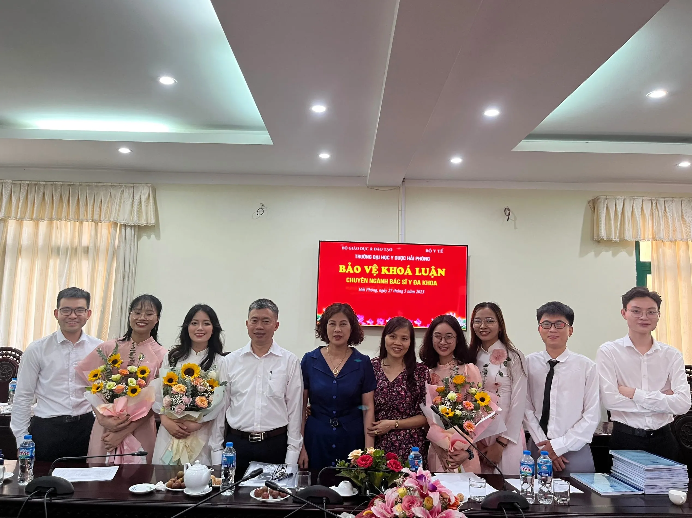

# Thực trạng và một số yếu tố liên quan đến dinh dưỡng ở bệnh nhân lao phổi mới tại Bệnh viện Phổi Hải Phòng năm 2022

_SV. Nguyễn Long Nhật, ThS.BS. Nguyễn Thị Trang_

## Tóm tắt khóa luận

**Mục tiêu nghiên cứu:** Mô tả thực trạng dinh dưỡng theo chỉ số BMI và phương pháp SGA, mô tả một số yếu tố liên quan đến thực trạng dinh dưỡng ở bệnh nhân lao phổi mới tại Bệnh viện Phổi Hải Phòng năm 2022.

**Phương pháp nghiên cứu:** Thiết kế theo phương pháp mô tả cắt ngang có sử dụng số liệu hồi cứu. Tiến hành trên đối tượng bệnh nhân được chẩn đoán lao phổi mới tại Bệnh viện Phổi Hải Phòng từ 01/01/2022 đến 31/12/2022.

**Kết quả nghiên cứu:** Theo BMI, suy dinh dưỡng và không suy dinh dưỡng có tỷ lệ lần lượt là 34,4% và 65,6%. Theo SGA, suy dinh dưỡng và không không suy dinh dưỡng có tỷ lệ lần lượt là 37,2% và 62,8%. Có mối liên quan giữa thực trạng dinh dưỡng và nghề nghiệp lao động tự do (p=0,035), triệu chứng sốt (p=0,001), mức độ tổn thương nặng trên phim X-quang (p<0,001), tổn thương có hang trên phim X-quang (p<0,001) và tình trạng có thiếu máu (p=0,002).

**Kết luận:** Tỷ lệ suy dinh dưỡng cao nhất ở những bệnh nhân từ 60 tuổi trở lên, nam giới, lao động tự do, nông thôn, chẩn đoán bệnh dưới 2 tháng. Một số yếu tố liên quan gồm nghề nghiệp, triệu chứng sốt, mức độ tổn thương và tổn thương có hang trên phim X-quang và tình trạng thiếu máu.

**Từ khóa:** Lao phổi, BMI, SGA, Dinh dưỡng

## Bản quyền

Bản quyền thuộc &copy; 2023 bởi Long Nhật Nguyễn.

## Hình ảnh

     
